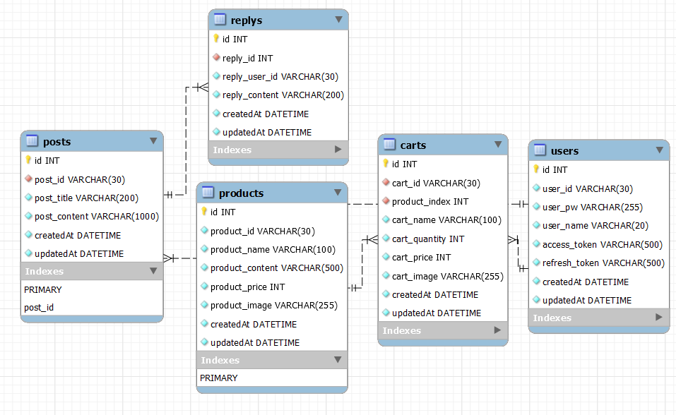
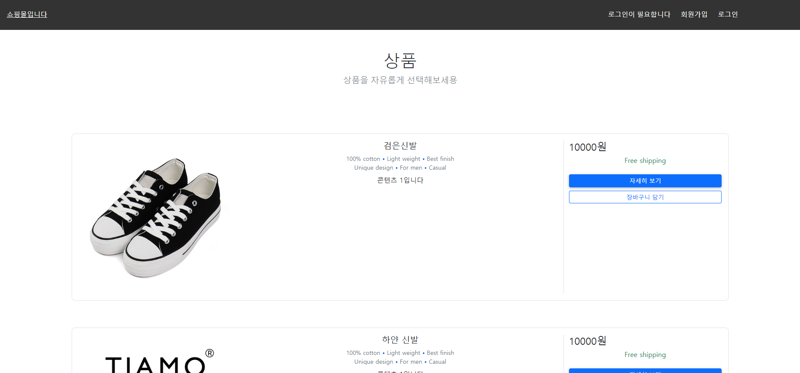

# 
**JuShoppingmall**

## Shoppingmall

### 기간 : 2022.10.21 ~ 2022.10.28

### 개발자 : 주병현

### 본인 역할

- **로그인**

  - Mysql을 이용한 로그인 구현
  
  - JWT를 이용한 로그인 유지

- **회원가입**

  - Mysql을 이용한 회원가입 구현

- ** Mysql설계 **

  - 로그인 : 로그인에 필요한 쇼핑몰 유저 저장

  - 회원가입 : 유입된 회원들을 저장할 수 있는 저장소 구현

  - 자유게시판 : 유저들이 자유롭게 글을 쓸 수 있는 게시판 구현
  
  - 댓글 : 유저들이 자유게시판에 있는 특정 글에 댓글을 달 수 있는 공간 구현
  
  - 장바구니 : 유저들이 마음에 드는 상품을 골라 담을 수 있는 저장공간 구현

- **프론트**

  - 로그인페이지

  - 회원가입 페이지

  - 자유게시판 페이지

  - 장바구니 페이지

---

## 목차

- [**개요**](#개요)
  - [Scripts](#Scripts)
- [**주요 페이지**](#주요-페이지)
  - [MainPage](#Main-Page)
  - [ShopPage](#Shop-Page)
  - [SwapPage](#Swap-Page)
  - [MyPage](#My-Page)
- [**주요 기능**](#주요-기능)
  - [지갑 연결](#지갑연결)
  - [민팅](#민팅)
  - [거래](#거래)
- [**기타**](#기타)
  - [PPT](#PPT)

---

## **개요**

### **Scripts**

#### client

`cd project`

npm start

#### backend

`cd backend`

npm start

---

## 사용 **기술**

 

 
 

 

---

- 전체 데이터베이스

 

 

- 메인 페이지

 

 

- 민팅 버튼

 

 

- 거래 페이지

 

 

- 판매 페이지

 

