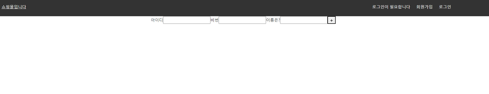
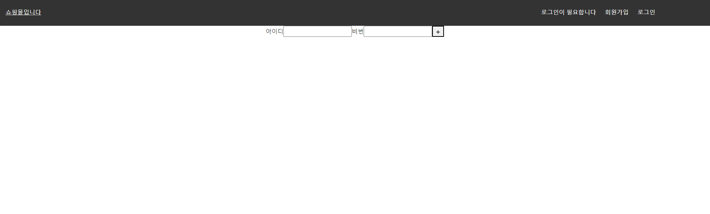
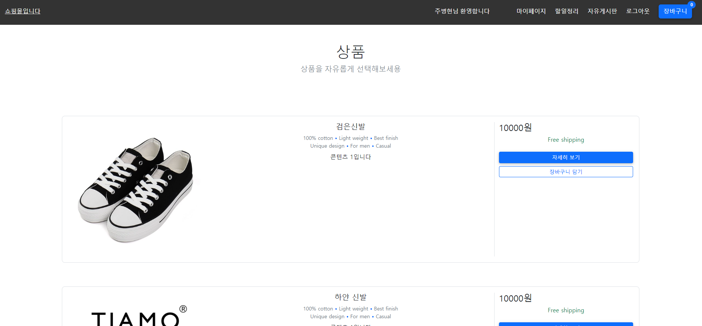
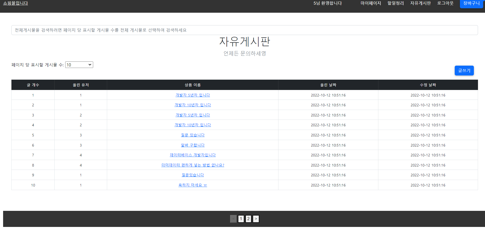
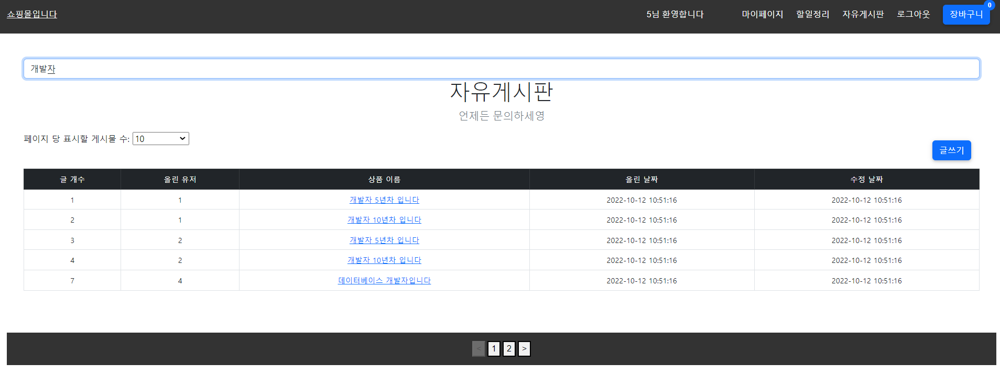
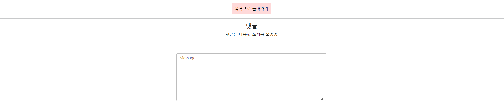
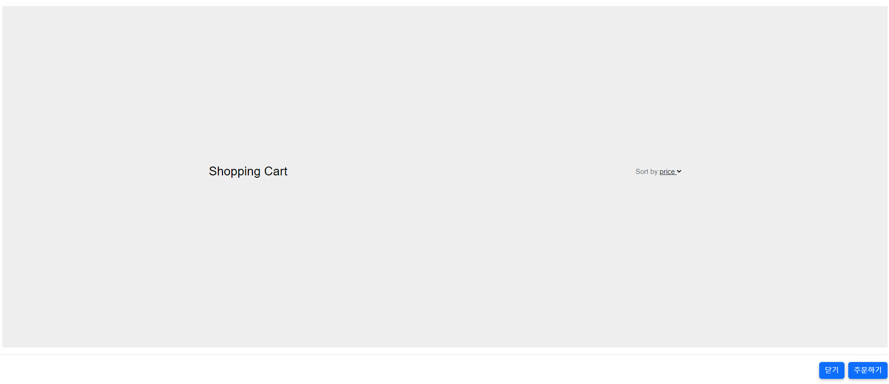

# <div align="center">**JuShoppingmall**</div>

## Shoppingmall

### 기간 : 2022.10.21 ~ 2022.10.28

### 개발자 : 주병현

### 본인 역할

- **로그인**

  - Mysql을 이용한 로그인 구현
  
  - JWT를 이용한 로그인 유지

- **회원가입**

  - Mysql을 이용한 회원가입 구현

- ** Mysql설계 **

  - 로그인 : 로그인에 필요한 쇼핑몰 유저 저장

  - 회원가입 : 유입된 회원들을 저장할 수 있는 저장소 구현

  - 자유게시판 : 유저들이 자유롭게 글을 쓸 수 있는 게시판 구현
  
  - 댓글 : 유저들이 자유게시판에 있는 특정 글에 댓글을 달 수 있는 공간 구현
  
  - 장바구니 : 유저들이 마음에 드는 상품을 골라 담을 수 있는 저장공간 구현

- **프론트**

  - 로그인페이지

  - 회원가입 페이지

  - 자유게시판 페이지

  - 장바구니 페이지

---

## 목차

- [**개요**](https://github.com/acca3434/JuShoppingmall#%EA%B0%9C%EC%9A%94)
- [**사용기술**](https://github.com/acca3434/JuShoppingmall#%EC%82%AC%EC%9A%A9-%EA%B8%B0%EC%88%A0)
  - [전체 데이터베이스](https://github.com/acca3434/JuShoppingmall#%EC%A0%84%EC%B2%B4-%EB%8D%B0%EC%9D%B4%ED%84%B0%EB%B2%A0%EC%9D%B4%EC%8A%A4
)
  - [메인 페이지](https://github.com/acca3434/JuShoppingmall#%EB%A9%94%EC%9D%B8-%ED%8E%98%EC%9D%B4%EC%A7%80)
  - [회원가입 페이지](https://github.com/acca3434/JuShoppingmall#%ED%9A%8C%EC%9B%90%EA%B0%80%EC%9E%85-%ED%8E%98%EC%9D%B4%EC%A7%80)
  - [로그인 페이지](https://github.com/acca3434/JuShoppingmall#%EB%A1%9C%EA%B7%B8%EC%9D%B8-%ED%8E%98%EC%9D%B4%EC%A7%80)
  - [로그인 후 페이지](https://github.com/acca3434/JuShoppingmall#%EB%A1%9C%EA%B7%B8%EC%9D%B8-%ED%9B%84-%ED%8E%98%EC%9D%B4%EC%A7%80)
  - [자유게시판 페이지](https://github.com/acca3434/JuShoppingmall#%EC%9E%90%EC%9C%A0%EA%B2%8C%EC%8B%9C%ED%8C%90-%ED%8E%98%EC%9D%B4%EC%A7%80)
  - [자유게시판 검색 기능(JQeury)](https://github.com/acca3434/JuShoppingmall#%EC%9E%90%EC%9C%A0%EA%B2%8C%EC%8B%9C%ED%8C%90-%EA%B2%80%EC%83%89-%EA%B8%B0%EB%8A%A5jqeury)
  - [자유게시판 댓글 기능](https://github.com/acca3434/JuShoppingmall#%EC%9E%90%EC%9C%A0%EA%B2%8C%EC%8B%9C%ED%8C%90-%EB%8C%93%EA%B8%80-%EA%B8%B0%EB%8A%A5
)
  - [장바구니 기능](https://github.com/acca3434/JuShoppingmall#%EC%9E%A5%EB%B0%94%EA%B5%AC%EB%8B%88-%EA%B8%B0%EB%8A%A5)
- [**힘든점 및 이슈**]()
---

## **개요**

### **Scripts**

#### client

`cd project`

npm start

#### backend

`cd backend`

npm start

---

## 사용 **기술**

 

 
 

 


---

### 전체 데이터베이스

<br/>


<br/>

### 메인 페이지

```JSX
 return (
        {userProduction
          ? userProduction.map((value) => {
              return (
                <MDBRow className="justify-content-center mb-0" key={value.id}>
                  <MDBCol md="12" xl="10">
                    <MDBCard className="shadow-0 border rounded-3 mt-5 mb-3">
                      <MDBCardBody>
                        <MDBRow>
                        
                        
                           (...)
                           
                           
                          >
                            <div className="d-flex flex-row align-items-center mb-1">
                              <h4 className="mb-1 me-1">
                                {value.product_price}원
                              </h4>
                              <span className="text-danger">
                              </span>
                            </div>
                            <h6 className="text-success">Free shipping</h6>
                            <div className="d-flex flex-column mt-4">
                              <MDBBtn color="primary" size="sm">
                                자세히 보기
                              </MDBBtn>
                              <MDBBtn
                                outline
                                color="primary"
                                size="sm"
                                className="mt-2"
                                onClick={() =>
                                  onShoppingCart({
                                    value: value,
                                    userSignInInfor: userSignInInfor,
                                  })
                                }
                              >
                                장바구니 담기
                              </MDBBtn>
                            </div>
                          </MDBCol>
                        </MDBRow>
                      </MDBCardBody>
                    </MDBCard>
                  </MDBCol>
                </MDBRow>
              );
            })
          : ""}
      </MDBContainer>
    </>
  );
```

<br/>


<br/>

### 회원가입 페이지

<br/>



<br/>

### 로그인 페이지

```JSX
const SignIn = ({
  signInIdinput,
  signInPwinput,
  signInchangeIdInput,
  signInchangePwInput,
  signInInsert,
}) => {
  const onChangeId = useCallback(
    (e) => {
      signInchangeIdInput(e.target.value);
    },
    [signInchangeIdInput]
  );
  const onChangePw = useCallback(
    (e) => {
      signInchangePwInput(e.target.value);
    },
    [signInchangePwInput]
  );
  const onSubmit = useCallback(
    (e) => {
      signInInsert(signInIdinput, signInPwinput);
      signInchangeIdInput(""); // value값 초기화
      signInchangePwInput(""); // value값 초기화
      e.preventDefault();
    },
    [
      signInInsert,
      signInchangeIdInput,
      signInchangePwInput,
      signInIdinput,
      signInPwinput,
    ]
  );
  return (
    <form className="TodoInsert" onSubmit={onSubmit}>
      <label>아이디</label>
      <input type="text" value={signInIdinput} onChange={onChangeId} />
      <label>비번</label>
      <input type="password" value={signInPwinput} onChange={onChangePw} />
      <button type="submit">
        <MdAdd />
      </button>
    </form>
  );
};
```

<br/>



<br/>

### 로그인 후 페이지

<br/>



<br/>

### 자유게시판 페이지

```JSX
           {userPosts
              ? userPosts
                  .slice(offset, offset + limit)
                  .map(
                    ({
                      id,
                      post_id,
                      post_title,
                      post_content,
                      createdAt,
                      updatedAt,
                    }) => {
                      return (
                        <tr key={id}>
                          <th scope="row">{id}</th>
                          <td>{post_id}</td>
                          <td>
                            <Link
                              to={`/detail/${id}/${post_id}/${post_title}/${post_content}`}
                            >
                              {post_title}
                            </Link>
                          </td>
                          <td>{createdAt}</td>
                          <td>{updatedAt}</td>
                        </tr>
                      );
                    }
                  )
              : "게시판 잘못 연결됐습니다 고객센터에 문의하세요"}
```

<br/>



<br/>

### 자유게시판 검색 기능(JQeury)

- - JQuery를 이용하여 실시간으로 검색가능하게 구현

```JQuery
  $(document).ready(function () {
    $("#search").keyup(function () {
      search_table($(this).val());
    });
    function search_table(value) {
      $("#employee_table tr").each(function () {
        let found = "false";
        $(this).each(function () {
          if ($(this).text().toLowerCase().indexOf(value.toLowerCase()) >= 0) {
            found = "true";
          }
        });
        if (found === "true") {
          $(this).show();
        } else {
          $(this).hide();
        }
      });
    }
  });
```


<br/>



<br/>

### 자유게시판 댓글 기능

```JSX
            {userReply
                ? userReply.map((value) => {
                    return (
                      <>
                        <MDBCardBody className="p-4">
                          <div className="d-flex flex-start">
                            <MDBCardImage
                              className="rounded-circle shadow-1-strong me-3"
                              src="https://mdbcdn.b-cdn.net/img/Photos/Avatars/img%20(23).webp"
                              alt="avatar"
                              width="60"
                              height="60"
                            />
                            <div>
                              <MDBTypography tag="h6" className="fw-bold mb-1">
                                닉네임 : {value.reply_user_id}
                              </MDBTypography>
                              <div className="d-flex align-items-center mb-3">
                                <p className="mb-0">{value.createdAt}</p>
                                <a href="#!" className="link-muted">
                                  <MDBIcon fas icon="pencil-alt ms-2" />
                                </a>
                                <a href="#!" className="link-muted">
                                  <MDBIcon fas icon="redo-alt ms-2" />
                                </a>
                                <a href="#!" className="link-muted">
                                  <MDBIcon fas icon="heart ms-2" />
                                </a>
                              </div>
                              <MDBTextArea
                                label={`${value.reply_content}`}
                                cols={150}
                                style={{ backgroundColor: "#fff" }}
                                className="p-5"
                              />
                            </div>
                          </div>
                        </MDBCardBody>
                        <hr className="my-0" />
                      </>
                    );
                  })
                : "댓글이 아직 없어요 ㅠ"}
```

<br/>



<br/>

### 장바구니 기능

```JSX
                 {userCartsList
                    ? userCartsList.map((value) => {
                        return (
                          <MDBCard className="rounded-3 mb-4" key={value.id}>
                            <MDBCardBody className="p-4">
                              <MDBRow className="justify-content-between align-items-center">
                                <MDBCol md="2" lg="2" xl="2">
                                  <p
                                    className="lead fw-normal mb-2"
                                    style={{ color: "black" }}
                                  >
                                    {value.cart_name}
                                  </p>
                                  <p>
                                    <span className="text-muted">사이즈: </span>
                                    M<span className="text-muted">Color: </span>
                                    Grey
                                  </p>
                                </MDBCol>
                                <MDBCol
                                  md="3"
                                  lg="3"
                                  xl="2"
                                  className="d-flex align-items-center justify-content-around"
                                >
                                  <MDBBtn color="link" className="px-2">
                                    <MDBIcon fas icon="minus" />
                                  </MDBBtn>
                                  <MDBInput
                                    min={0}
                                    defaultValue={value.cart_quantity}
                                    type="number"
                                    size="sm"
                                  />
                                  <MDBBtn color="link" className="px-2">
                                    <MDBIcon fas icon="plus" />
                                  </MDBBtn>
                                </MDBCol>
                                <MDBCol
                                  md="3"
                                  lg="2"
                                  xl="2"
                                  className="offset-lg-1"
                                >
                          </MDBCard>
                        );
                      })
                    : ""}
                </MDBCol>
              </MDBRow>
            </MDBContainer>
          </section>
        </MDBModalBody>
        <MDBModalFooter className="justify-content-end">
          <MDBBtn color="primary" onClick={() => cartModalToggle()}>
            닫기
          </MDBBtn>
          <MDBBtn color="primary" onClick={() => cartModalToggle()}>
            주문하기
          </MDBBtn>
```
<br/>



<br/>


## 힘든점 및 이슈상황

### 유저가 담긴 장바구니가 제대로 안담기는 상황 발생

- 예상되는 이슈로는 PrivateKey & foreignKey가 제대로 설정 안된것 같음

- 수정 후 반영하겠음

### 유저가 써놓은 댓글기능이 어느순간 상호작용이 되질 않음

- 이슈 디버깅 테스트결과 이 역시 PrivateKey & foreignKey가 제대로 설정 안됐음

- 수정 후 반영하겠음

### 비밀키 외부키 연결관계설정이 좀 까다로운것 같음

- 이 문제 때문에 장바구니 및 댓글 기능이 작동되었다 안되었다 함

- 관계설정 파악 후 이슈 수정하겠음

### 로그인 및 회원가입 Front View 자체 코드가 부실함

- Front View기능에 신경못쓴점이 큼

- Frontend 부분 R&D 후 
